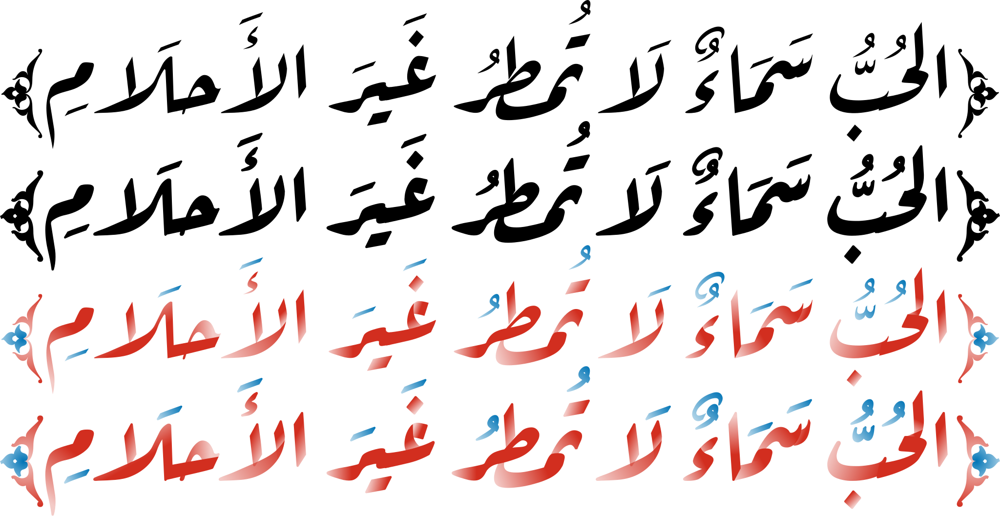

Aref Ruqaa
==========

Aref Ruqaa (رقعة عارف) is an Arabic typeface that aspires to capture the essence of
the classical [Ruqaa][1] calligraphic style.

The Arabic part of Aref Ruqaa is designed by the Arabic calligrapher and type
designer [Abdullah Aref][2], while the Latin part is based on [AMS Euler][3],
but spaced for regular text rather than mathematics.

Aref Ruqaa is available also on [Google Fonts][4].

[1]: https://en.wikipedia.org/wiki/Ruqʿah_script
[2]: https://www.facebook.com/areffonts
[3]: https://en.wikipedia.org/wiki/AMS_Euler
[4]: https://fonts.google.com/specimen/Aref+Ruqaa?subset=arabic
