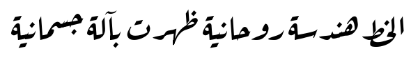

Aref Ruqaa
==========

Aref Ruqaa is an Arabic typeface that aspires to capture the essence of
the classical [Ruqaa] [1] calligraphic style.

The Latin part is based on [AMS Euler] [2], but spaced for regular text
rather than mathematics.

Aref Ruqaa is a work in progress and is not yet ready for wider use.

[1]: https://en.wikipedia.org/wiki/Ruqʿah_script
[2]: https://en.wikipedia.org/wiki/AMS_Euler
