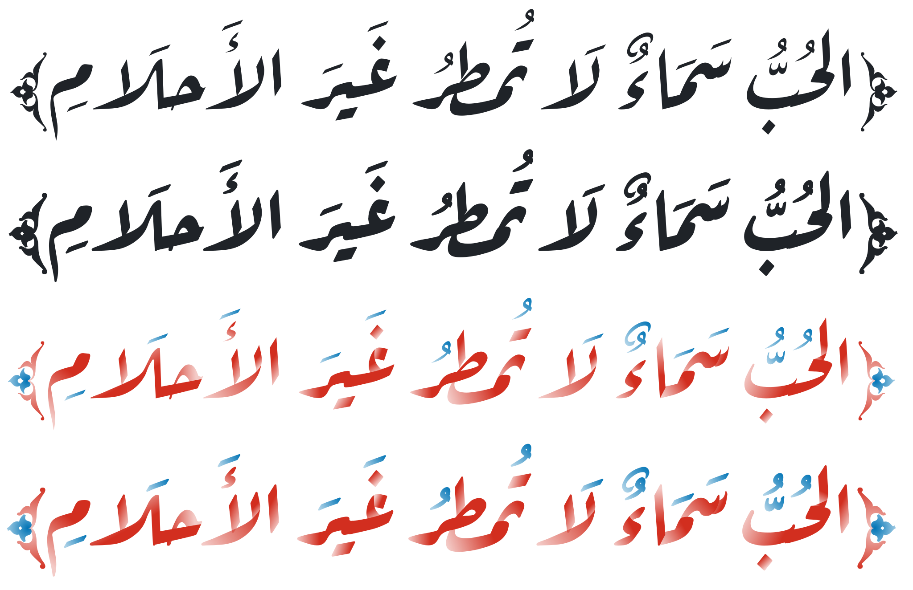

Aref Ruqaa
==========

Aref Ruqaa (رقعة عارف) is an Arabic typeface that aspires to capture the essence of
the classical [Ruqaa][1] calligraphic style.

The Arabic part of Aref Ruqaa is designed by the Arabic calligrapher and type
designer [Abdullah Aref][2], while the Latin part is based on [AMS Euler][3],
but spaced for regular text rather than mathematics.

Aref Ruqaa comes in two weights, regular and bold. It also comes in two
variants, the usual monochrome variants as will as an Ink variant. The Ink
variants are [color fonts][5] where the colors are defined by the font itself.
Support for color font is currently limited to few applications like Google
Chrome (version 98 or later) and [FontGoggles][6] (version 1.4.0 or later).

Aref Ruqaa is available also on [Google Fonts][4].

[1]: https://en.wikipedia.org/wiki/Ruqʿah_script
[2]: https://www.facebook.com/areffonts
[3]: https://en.wikipedia.org/wiki/AMS_Euler
[4]: https://fonts.google.com/specimen/Aref+Ruqaa?subset=arabic
[5]: https://developer.chrome.com/blog/colrv1-fonts/
[6]: https://fontgoggles.org/
